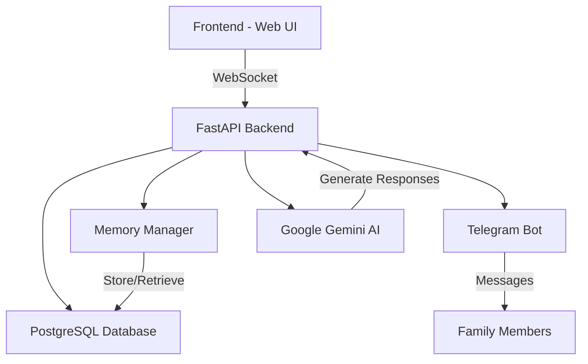

# 🧠 Compa - AI Voice Assistant for Alzheimer's Care

(it's done for Spanish Speakers, but also works in other languages, [spanish version below](#spanish-version))

## English Version

Compa is an innovative AI-powered voice assistant specifically designed to support individuals with memory issues (like the Alzheimer's disease) and their families. It combines real-time voice interaction, memory management, and family communication features to provide a comprehensive care solution.

## 🌟 Key Features

* [Features](#key-features)
* [Architecture Overview](#technical-architecture)
* [Repository Structure](#repository-structure)
* [Getting Started](#getting-started)
* [Core Components](#core-components)
* [Security Considerations](#ecurity-features)
* [Contributing](#contributing)
* [License](#license)
* [Acknowledgments](#acknowledgments)

---

* **🎙️ Voice-First Interaction**: Natural conversation interface using Web Speech API
* **🧠 Memory Management**: Intelligent system to store and recall personal memories
* **👨‍👩‍👧‍👦 Family Connection**: Integrated Telegram bot for family messaging
* **🤖 AI-Powered Responses**: Context-aware responses using Google Gemini AI
* **🔄 Real-Time Updates**: WebSocket-based instant communication
* **🗄️ Database Integration**: Robust PostgreSQL storage with SQLAlchemy ORM
* **📱 Device Management**: Multi-device support with secure connection codes

## 🏗️ Technical Architecture


## 💻 Tech Stack

### Backend

* **FastAPI**: High-performance async web framework
* **SQLAlchemy**: SQL toolkit and ORM
* **PostgreSQL**: Primary database (via asyncpg)
* **Google Gemini AI**: Advanced language model integration
* **python-telegram-bot**: Telegram integration
* **WebSocket**: Real-time communication

### Frontend

* **HTML5**: Modern semantic markup
* **CSS3**: Responsive design with animations
* **JavaScript**: Web Speech API integration
* **WebSocket**: Live updates and communication

---

## Repository Structure
```
Compa/
│
├── backend/
│   ├── main.py            # FastAPI backend and WebSocket
│   ├── telegram_bot.py    # Telegram bot integration
│
├── frontend/
│   ├── static/
│   │   ├── index.html       # Main UI
│   │   ├── style.css        # Interface stylesheet
│   │   └── app.js           # WebSocket, UI logic, speech features
│
├── requirements.txt         # Backend Python dependencies
├── .env                     # Environment configuration (not committed)
├── README.md                # Documentation
└── LICENSE.md               # License
```
---

## Getting Started

### Prerequisites

* Python >= 3.11
* Telegram account to set up the bot
* API access to Google Gemini (via developer token)

### Installation Steps

1.  **Clone the repository:**
    ```
    git clone [https://github.com/ogarmar/Compa.git](https://github.com/ogarmar/Compa.git)
    cd Compa
    ```
2.  **Install Python dependencies:**
    ```
    pip install -r requirements.txt
    ```
3.  **Configure environment variables (`.env`):**
    ```
    GEMINI_TOKEN=your_gemini_api_key
    TELEGRAM_BOT_TOKEN=your_telegram_bot_token
    ```
4.  **Start the backend server:**
    ```
    python backend/main.py
    ```
5.  **Open the frontend in your browser:**
    * Go to `http://localhost:8000` (by default)

6.  **To send messages to Compa**
    * Search this bot on telegram: @Compa_IA_bot
    * Send the bot the message: /start
    * Connect to yours/your family member Compa user by typing: /connect (and yours/their number)
---

## 📱 Device Management

Compa uses a secure device management system with unique 6-digit codes:

* Each device gets a unique identifier
* Family members connect via Telegram using device codes
* Database-driven device tracking and validation
* Real-time connection status monitoring

## 🔐 Security Features

* **Secure WebSocket Connections**: Real-time encrypted communication
* **Database Authentication**: Protected PostgreSQL connections
* **Device Validation**: Unique code-based device authentication
* **Telegram Authorization**: Whitelist-based user access
* **Environment Variables**: Secure credential management

## 📚 API Documentation

### WebSocket Endpoints

* `/ws`: Main WebSocket connection
    * Handles real-time communication
    * Manages device connections
    * Routes messages and responses

### HTTP Endpoints

* `/`: Serves the main application
* `/static/*`: Static files (CSS, JavaScript)
* Additional API documentation available via SwaggerUI at `/docs`

## 🤝 Contributing

Contributions are welcome! Please feel free to submit a Pull Request. For major changes, please open an issue first to discuss what you would like to change.

## 📄 License

This project is licensed under a custom license - see the [LICENSE.md](LICENSE.md) file for details.

## 🙏 Acknowledgments

* Google Gemini AI for providing the language model
* Telegram for the bot API
* FastAPI community for the excellent framework
* All contributors and supporters of the project

## 📧 Contact

For support or queries, please open an issue or contact me through our [e-mail](mailto:oscargarciatrabajos@gmail.com)
---

Made with ❤️ for people with memory issues and their families

Enjoy talking, sharing and building with Compa!


---------------------------------------------------------------
---------------------------------------------------------------
---------------------------------------------------------------


## Spanish Version

# 🧠 Compa - Asistente de Voz con IA para el Cuidado del Alzheimer

[English version above](#english-version) | Versión en Español

Compa es un innovador asistente de voz potenciado por IA, específicamente diseñado para apoyar a personas con problemas de memoria (como la enfermedad de Alzheimer) y sus familias. Combina interacción por voz en tiempo real, gestión de memoria y características de comunicación familiar para proporcionar una solución integral de cuidado.

## 🌟 Características Principales

* [Características](#caracter%C3%ADsticas-principales)
* [Visión General de la Arquitectura](#arquitectura-t%C3%A9cnica)
* [Estructura del Repositorio](#estructura-del-repositorio)
* [Primeros Pasos](#primeros-pasos)
* [Consideraciones de Seguridad](#caracter%C3%ADsticas-de-seguridad)
* [Contribuir](#contribuir)
* [Licencia](#licencia)
* [Agradecimientos](#agradecimientos)

---

* **🎙️ Interacción por Voz**: Interfaz de conversación natural usando Web Speech API
* **🧠 Gestión de Memoria**: Sistema inteligente para almacenar y recordar memorias personales
* **👨‍👩‍👧‍👦 Conexión Familiar**: Bot de Telegram integrado para mensajería familiar
* **🤖 Respuestas con IA**: Respuestas contextuales usando Google Gemini AI
* **🔄 Actualizaciones en Tiempo Real**: Comunicación instantánea basada en WebSocket
* **🗄️ Integración con Base de Datos**: Almacenamiento robusto en PostgreSQL con SQLAlchemy ORM
* **📱 Gestión de Dispositivos**: Soporte multi-dispositivo con códigos de conexión seguros

## 🏗️ Arquitectura Técnica

## 💻 Stack Tecnológico

### Backend

* **FastAPI**: Framework web asíncrono de alto rendimiento
* **SQLAlchemy**: Kit de herramientas SQL y ORM
* **PostgreSQL**: Base de datos principal (vía asyncpg)
* **Google Gemini AI**: Integración de modelo de lenguaje avanzado
* **python-telegram-bot**: Integración con Telegram
* **WebSocket**: Comunicación en tiempo real

### Frontend

* **HTML5**: Marcado semántico moderno
* **CSS3**: Diseño responsivo con animaciones
* **JavaScript**: Integración de Web Speech API
* **WebSocket**: Actualizaciones en vivo y comunicación

---

## Estructura del Repositorio
```
Compa/
│
├── backend/
│   ├── main.py            # Backend FastAPI y WebSocket
│   ├── telegram_bot.py    # Integración del bot de Telegram
│
├── frontend/
│   ├── static/
│   │   ├── index.html       # UI Principal
│   │   ├── style.css        # Hoja de estilos
│   │   └── app.js           # Lógica WebSocket, UI y funciones de voz
│
├── requirements.txt         # Dependencias Python del backend
├── .env                     # Configuración de entorno (no incluido)
├── README.md                # Documentación
└── LICENSE.md               # Licencia
```

## Primeros Pasos

### Prerrequisitos

* Python >= 3.11
* Cuenta de Telegram para configurar el bot
* Acceso a la API de Google Gemini (vía token de desarrollador)

### Pasos de Instalación

1.  **Clonar el repositorio:**
    ```
    git clone [https://github.com/ogarmar/Compa.git](https://github.com/ogarmar/Compa.git)
    cd Compa
    ```
2.  **Instalar dependencias de Python:**
    ```
    pip install -r requirements.txt
    ```
3.  **Configurar variables de entorno (`.env`):**
    ```
    GEMINI_TOKEN=tu_clave_api_gemini
    TELEGRAM_BOT_TOKEN=tu_token_bot_telegram
    ```
4.  **Iniciar el servidor backend:**
    ```
    python backend/main.py
    ```
5.  **Abrir el frontend en el navegador:**
    * Ir a `http://localhost:8000` (por defecto)

6.  **Para enviar mensajes a Compa:**
    * Buscar este bot en Telegram: @Compa_IA_bot
    * Enviar el mensaje: /start
    * Conectar con tu usuario o el de tu familiar usando: /connect (y tu/su número)

---

## 📱 Gestión de Dispositivos

Compa utiliza un sistema seguro de gestión de dispositivos con códigos únicos de 6 dígitos:

* Cada dispositivo recibe un identificador único
* Los familiares se conectan vía Telegram usando códigos de dispositivo
* Seguimiento y validación de dispositivos basado en base de datos
* Monitoreo de estado de conexión en tiempo real

## 🔐 Características de Seguridad

* **Conexiones WebSocket Seguras**: Comunicación encriptada en tiempo real
* **Autenticación de Base de Datos**: Conexiones PostgreSQL protegidas
* **Validación de Dispositivos**: Autenticación basada en códigos únicos
* **Autorización de Telegram**: Acceso basado en lista blanca
* **Variables de Entorno**: Gestión segura de credenciales

## 📚 Documentación de la API

### Endpoints WebSocket

* `/ws`: Conexión WebSocket principal
    * Maneja comunicación en tiempo real
    * Gestiona conexiones de dispositivos
    * Enruta mensajes y respuestas

### Endpoints HTTP

* `/`: Sirve la aplicación principal
* `/static/*`: Archivos estáticos (CSS, JavaScript)
* Documentación adicional de la API disponible vía SwaggerUI en `/docs`

## 🤝 Contribuir

¡Las contribuciones son bienvenidas! No dudes en enviar un Pull Request. Para cambios importantes, por favor abre primero un issue para discutir lo que te gustaría cambiar.

## 📄 Licencia

Este proyecto está licenciado bajo una licencia personalizada - ver el archivo [LICENSE.md](LICENSE.md) para más detalles.

## 🙏 Agradecimientos

* Google Gemini AI por proporcionar el modelo de lenguaje
* Telegram por la API del bot
* Comunidad FastAPI por el excelente framework
* Todos los contribuidores y colaboradores del proyecto

## 📧 Contacto

Para soporte o consultas, por favor abre un issue o contáctame a través de [email](mailto:oscargarciatrabajos@gmail.com).

---

Hecho con ❤️ para personas con problemas de memoria y sus familias

¡Disfruta conversando, compartiendo y construyendo con Compa!
