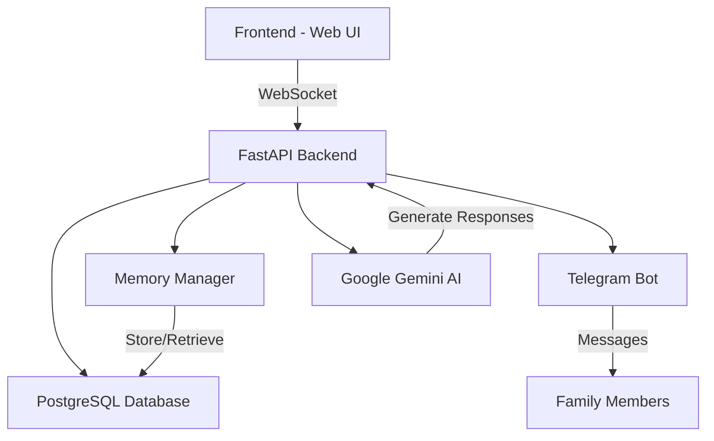

<<<<<<< HEAD
# 🧠 Compa - Asistente de Voz con IA para el Cuidado del Alzheimer

[English version above](#english) | Versión en Español
=======
# 🧠 Compa - AI Voice Assistant for Alzheimer's Care 
>>>>>>> cdf0d530a10860671d47c8bee5a1b0142affd165

(it's done for Spanish Speakers, but also works in other languages, [spanish version below](#spanish-version))
## English Version
[](https://www.python.org/downloads/)
[](https://fastapi.tiangolo.com/)
[](https://www.sqlalchemy.org/)
[](https://ai.google.dev/)

<<<<<<< HEAD
Compa es un innovador asistente de voz potenciado por IA, específicamente diseñado para apoyar a personas con problemas de memoria (como la enfermedad de Alzheimer) y sus familias. Combina interacción por voz en tiempo real, gestión de memoria y características de comunicación familiar para proporcionar una solución integral de cuidado.
=======
Compa is an innovative AI-powered voice assistant specifically designed to support individuals with memory issues (like the Alzheimer's disease) and their families. It combines real-time voice interaction, memory management, and family communication features to provide a comprehensive care solution.
>>>>>>> cdf0d530a10860671d47c8bee5a1b0142affd165

## 🌟 Características Principales

<<<<<<< HEAD
- [Características](#características)
- [Visión General de la Arquitectura](#visión-general-de-la-arquitectura)
- [Estructura del Repositorio](#estructura-del-repositorio)
- [Primeros Pasos](#primeros-pasos)
- [Configuración](#configuración)
- [Componentes Principales](#componentes-principales)
- [Flujo de Datos](#flujo-de-datos)
- [Consideraciones de Seguridad](#consideraciones-de-seguridad)
- [Solución de Problemas](#solución-de-problemas)
- [Contribuir](#contribuir)
- [Licencia](#licencia)
- [Agradecimientos](#agradecimientos)
=======
- [Features](#key-features)
- [Architecture Overview](#technical-architecture)
- [Repository Structure](#repository-structure)
- [Getting Started](#getting-started)
- [Configuration](#configuration)
- [Core Components](#core-components)
- [Data Flow](#data-flow)
- [Security Considerations](#security-considerations)
- [Troubleshooting](#troubleshooting)
- [Contributing](#contributing)
- [License](#license)
- [Acknowledgments](#acknowledgments)
>>>>>>> cdf0d530a10860671d47c8bee5a1b0142affd165

---

- **🎙️ Interacción por Voz**: Interfaz de conversación natural usando Web Speech API
- **🧠 Gestión de Memoria**: Sistema inteligente para almacenar y recordar memorias personales
- **👨‍👩‍👧‍👦 Conexión Familiar**: Bot de Telegram integrado para mensajería familiar
- **🤖 Respuestas con IA**: Respuestas contextuales usando Google Gemini AI
- **🔄 Actualizaciones en Tiempo Real**: Comunicación instantánea basada en WebSocket
- **🗄️ Integración con Base de Datos**: Almacenamiento robusto en PostgreSQL con SQLAlchemy ORM
- **📱 Gestión de Dispositivos**: Soporte multi-dispositivo con códigos de conexión seguros

## 🏗️ Arquitectura Técnica



## 💻 Stack Tecnológico

### Backend

- **FastAPI**: Framework web asíncrono de alto rendimiento
- **SQLAlchemy**: Kit de herramientas SQL y ORM
- **PostgreSQL**: Base de datos principal (vía asyncpg)
- **Google Gemini AI**: Integración de modelo de lenguaje avanzado
- **python-telegram-bot**: Integración con Telegram
- **WebSocket**: Comunicación en tiempo real

### Frontend

- **HTML5**: Marcado semántico moderno
- **CSS3**: Diseño responsivo con animaciones
- **JavaScript**: Integración de Web Speech API
- **WebSocket**: Actualizaciones en vivo y comunicación

---

## Estructura del Repositorio

```
Compa/
│
├── backend/
│   ├── main.py              # Backend FastAPI y WebSocket
│   ├── telegram_bot.py      # Integración del bot de Telegram
│
├── frontend/
│   ├── static/
│   │   ├── index.html       # UI Principal
│   │   ├── style.css        # Hoja de estilos
│   │   └── app.js           # Lógica WebSocket, UI y funciones de voz
│
├── requirements.txt         # Dependencias Python del backend
├── .env                     # Configuración de entorno (no incluido)
└── README.md                # Documentación
```

---

## Primeros Pasos

### Prerrequisitos

- Python >= 3.11
- Cuenta de Telegram para configurar el bot
- Acceso a la API de Google Gemini (vía token de desarrollador)

### Pasos de Instalación

1. **Clonar el repositorio:**
   ```
   git clone https://github.com/ogarmar/Compa.git
   cd Compa
   ```
2. **Instalar dependencias de Python:**
   ```
   pip install -r requirements.txt
   ```
3. **Configurar variables de entorno (`.env`):**
   ```
   GEMINI_TOKEN=tu_clave_api_gemini
   TELEGRAM_BOT_TOKEN=tu_token_bot_telegram
   ```
4. **Iniciar el servidor backend:**
   ```
   python backend/main.py
   ```
<<<<<<< HEAD
5. **Abrir el frontend en el navegador:**

   - Ir a `http://localhost:8000` (por defecto)

6. **Para enviar mensajes a Compa:**
   - Buscar este bot en Telegram: @Compa_IA_bot
   - Enviar el mensaje: /start
   - Conectar con tu usuario o el de tu familiar usando: /connect (y tu/su número)

=======
5. **Open the frontend in your browser:**
   - Go to `http://localhost:8000` (by default)
     
6. **To send messages to Compa**
    - Search this bot on telegram: @Compa_IA_bot
    - Send the bot the message: /start
    - Connect to yours/your family member Compa user by typing: /connect (and yours/their number)
>>>>>>> cdf0d530a10860671d47c8bee5a1b0142affd165
---

## 📱 Gestión de Dispositivos

Compa utiliza un sistema seguro de gestión de dispositivos con códigos únicos de 6 dígitos:

- Cada dispositivo recibe un identificador único
- Los familiares se conectan vía Telegram usando códigos de dispositivo
- Seguimiento y validación de dispositivos basado en base de datos
- Monitoreo de estado de conexión en tiempo real

## 🔐 Características de Seguridad

- **Conexiones WebSocket Seguras**: Comunicación encriptada en tiempo real
- **Autenticación de Base de Datos**: Conexiones PostgreSQL protegidas
- **Validación de Dispositivos**: Autenticación basada en códigos únicos
- **Autorización de Telegram**: Acceso basado en lista blanca
- **Variables de Entorno**: Gestión segura de credenciales

## 📚 Documentación de la API

### Endpoints WebSocket

- `/ws`: Conexión WebSocket principal
  - Maneja comunicación en tiempo real
  - Gestiona conexiones de dispositivos
  - Enruta mensajes y respuestas

### Endpoints HTTP

- `/`: Sirve la aplicación principal
- `/static/*`: Archivos estáticos (CSS, JavaScript)
- Documentación adicional de la API disponible vía SwaggerUI en `/docs`

## 🤝 Contribuir

¡Las contribuciones son bienvenidas! No dudes en enviar un Pull Request. Para cambios importantes, por favor abre primero un issue para discutir lo que te gustaría cambiar.

## 📄 Licencia

Este proyecto está licenciado bajo la Licencia MIT - ver el archivo [LICENSE](LICENSE) para más detalles.

## 🙏 Agradecimientos

- Google Gemini AI por proporcionar el modelo de lenguaje
- Telegram por la API del bot
- Comunidad FastAPI por el excelente framework
- Todos los contribuidores y colaboradores del proyecto

## 📧 Contacto

<<<<<<< HEAD
Para soporte o consultas, por favor abre un issue o contáctame a través de [email](oscargarciatrabajos@gmail.com).

---

Hecho con ❤️ para personas con problemas de memoria y sus familias

¡Disfruta conversando, compartiendo y construyendo con Compa!

Compa uses environment variables for sensitive information. Add the following variables to a `.env` file in your project root:

```
GEMINI_TOKEN=your_gemini_api_key
TELEGRAM_BOT_TOKEN=your_telegram_bot_token
```

---

## Core Components

### Backend (FastAPI + WebSocket)

- Handles all application logic and connections.
- Manages WebSocket endpoint `/ws` for real-time communication.
- Loads and persists user memories.
- Processes incoming requests: general chat, family messages, and memory recall.
- Generates responses using the Gemini generative model.

### Telegram Bot Integration

- Retrieves family messages from Telegram chats.
- Handles daily and unread message requests.
- Integrates seamlessly with backend via API calls.

### Memory Management

- Tracks user conversations, events, important dates, preferences.
- Stores, loads, queries, and updates memory objects for rich context.
- Enables personalized, consistent, and context-aware responses.

### Generative AI Model (Gemini)

- Empathetic response generation.
- Integrates memory and conversational context.
- Customizable via prompt engineering.

### Frontend (HTML/CSS/JavaScript)

- WebSocket client for real-time messaging.
- Voice input with Web Speech API.
- Family messages and memory recall UI features.

---

## Data Flow

1. **User interacts via frontend (text/voice):**
   - Input sent to backend over WebSocket.
2. **Backend processes input:**
   - Loads user memory, checks message type.
   - Queries Gemini for generative response or Telegram bot for family messages.
   - Updates memory as needed.
3. **Backend responds:**
   - Sends reply back over WebSocket.
   - Response is displayed and (optionally) spoken using frontend speech synthesis.
4. **Session and memory continuity:**
   - Past interactions influence ongoing conversation.

---

## Security Considerations

- **Environment variable protection:** Do not commit `.env` files.
- **API key safety:** Store keys securely and rotate regularly.
- **WebSocket validation:** (Recommended) Authenticate connections for production.

---

## Troubleshooting

- **WebSocket connection issues?:** Confirm backend is running; check CORS settings.
- **Gemini API errors?:** Verify your token, quota, and API service status.
- **Telegram bot not responding?:** Double-check token, bot status, and internet connectivity.

---

## Contributing

Contributions are welcome! Feel free to contact oscargarciatrabajos@gmail.com to discuss your ideas, improvements, or issues. Pull requests and issues are also accepted via GitHub.

---

## License

MIT License

---

## Acknowledgments

- [FastAPI](https://fastapi.tiangolo.com/)
- [Python-Telegram-Bot](https://python-telegram-bot.org/)
- [Google Gemini](https://ai.google.dev/)
- All open-source contributors and projects that make Compa possible.

---
=======
For support or queries, please open an issue or contact me through our [e-mail](oscargarciatrabajos@gmail.com)
---

Made with ❤️ for people with memory issues and their families
>>>>>>> cdf0d530a10860671d47c8bee5a1b0142affd165

Enjoy talking, sharing and building with Compa!


======================================================================================
--------------------------------------------------------------------------------------
======================================================================================
--------------------------------------------------------------------------------------
======================================================================================

## Spanish Version

# 🧠 Compa - Asistente de Voz con IA para el Cuidado del Alzheimer

[English version above](#english-version) | Versión en Español

[](https://www.python.org/downloads/)
[](https://fastapi.tiangolo.com/)
[](https://www.sqlalchemy.org/)
[](https://ai.google.dev/)

Compa es un innovador asistente de voz potenciado por IA, específicamente diseñado para apoyar a personas con problemas de memoria (como la enfermedad de Alzheimer) y sus familias. Combina interacción por voz en tiempo real, gestión de memoria y características de comunicación familiar para proporcionar una solución integral de cuidado.

## 🌟 Características Principales

- [Características](#características-principales)
- [Visión General de la Arquitectura](#arquitectura-técnica)
- [Estructura del Repositorio](#estructura-del-repositorio)
- [Primeros Pasos](#primeros-pasos)
- [Configuración](#configuración)
- [Componentes Principales](#componentes-principales)
- [Flujo de Datos](#flujo-de-datos)
- [Consideraciones de Seguridad](#consideraciones-de-seguridad)
- [Solución de Problemas](#solución-de-problemas)
- [Contribuir](#contribuir)
- [Licencia](#licencia)
- [Agradecimientos](#agradecimientos)

---

- **🎙️ Interacción por Voz**: Interfaz de conversación natural usando Web Speech API
- **🧠 Gestión de Memoria**: Sistema inteligente para almacenar y recordar memorias personales
- **👨‍👩‍👧‍👦 Conexión Familiar**: Bot de Telegram integrado para mensajería familiar
- **🤖 Respuestas con IA**: Respuestas contextuales usando Google Gemini AI
- **🔄 Actualizaciones en Tiempo Real**: Comunicación instantánea basada en WebSocket
- **🗄️ Integración con Base de Datos**: Almacenamiento robusto en PostgreSQL con SQLAlchemy ORM
- **📱 Gestión de Dispositivos**: Soporte multi-dispositivo con códigos de conexión seguros

## 🏗️ Arquitectura Técnica


## 💻 Stack Tecnológico

### Backend

- **FastAPI**: Framework web asíncrono de alto rendimiento
- **SQLAlchemy**: Kit de herramientas SQL y ORM
- **PostgreSQL**: Base de datos principal (vía asyncpg)
- **Google Gemini AI**: Integración de modelo de lenguaje avanzado
- **python-telegram-bot**: Integración con Telegram
- **WebSocket**: Comunicación en tiempo real

### Frontend

- **HTML5**: Marcado semántico moderno
- **CSS3**: Diseño responsivo con animaciones
- **JavaScript**: Integración de Web Speech API
- **WebSocket**: Actualizaciones en vivo y comunicación

---

## Estructura del Repositorio

```
Compa/
│
├── backend/
│   ├── main.py              # Backend FastAPI y WebSocket
│   ├── telegram_bot.py      # Integración del bot de Telegram
│
├── frontend/
│   ├── static/
│   │   ├── index.html       # UI Principal
│   │   ├── style.css        # Hoja de estilos
│   │   └── app.js           # Lógica WebSocket, UI y funciones de voz
│
├── requirements.txt         # Dependencias Python del backend
├── .env                     # Configuración de entorno (no incluido)
└── README.md                # Documentación
```

---

## Primeros Pasos

### Prerrequisitos

- Python >= 3.11
- Cuenta de Telegram para configurar el bot
- Acceso a la API de Google Gemini (vía token de desarrollador)

### Pasos de Instalación

1. **Clonar el repositorio:**
   ```
   git clone https://github.com/ogarmar/Compa.git
   cd Compa
   ```
2. **Instalar dependencias de Python:**
   ```
   pip install -r requirements.txt
   ```
3. **Configurar variables de entorno (`.env`):**
   ```
   GEMINI_TOKEN=tu_clave_api_gemini
   TELEGRAM_BOT_TOKEN=tu_token_bot_telegram
   ```
4. **Iniciar el servidor backend:**
   ```
   python backend/main.py
   ```
5. **Abrir el frontend en el navegador:**

   - Ir a `http://localhost:8000` (por defecto)

6. **Para enviar mensajes a Compa:**
   - Buscar este bot en Telegram: @Compa_IA_bot
   - Enviar el mensaje: /start
   - Conectar con tu usuario o el de tu familiar usando: /connect (y tu/su número)

---

## 📱 Gestión de Dispositivos

Compa utiliza un sistema seguro de gestión de dispositivos con códigos únicos de 6 dígitos:

- Cada dispositivo recibe un identificador único
- Los familiares se conectan vía Telegram usando códigos de dispositivo
- Seguimiento y validación de dispositivos basado en base de datos
- Monitoreo de estado de conexión en tiempo real

## 🔐 Características de Seguridad

- **Conexiones WebSocket Seguras**: Comunicación encriptada en tiempo real
- **Autenticación de Base de Datos**: Conexiones PostgreSQL protegidas
- **Validación de Dispositivos**: Autenticación basada en códigos únicos
- **Autorización de Telegram**: Acceso basado en lista blanca
- **Variables de Entorno**: Gestión segura de credenciales

## 📚 Documentación de la API

### Endpoints WebSocket

- `/ws`: Conexión WebSocket principal
  - Maneja comunicación en tiempo real
  - Gestiona conexiones de dispositivos
  - Enruta mensajes y respuestas

### Endpoints HTTP

- `/`: Sirve la aplicación principal
- `/static/*`: Archivos estáticos (CSS, JavaScript)
- Documentación adicional de la API disponible vía SwaggerUI en `/docs`

## 🤝 Contribuir

¡Las contribuciones son bienvenidas! No dudes en enviar un Pull Request. Para cambios importantes, por favor abre primero un issue para discutir lo que te gustaría cambiar.

## 📄 Licencia

Este proyecto está licenciado bajo la Licencia MIT - ver el archivo [LICENSE](LICENSE) para más detalles.

## 🙏 Agradecimientos

- Google Gemini AI por proporcionar el modelo de lenguaje
- Telegram por la API del bot
- Comunidad FastAPI por el excelente framework
- Todos los contribuidores y colaboradores del proyecto

## 📧 Contacto

Para soporte o consultas, por favor abre un issue o contáctame a través de [email](oscargarciatrabajos@gmail.com).

---

Hecho con ❤️ para personas con problemas de memoria y sus familias

¡Disfruta conversando, compartiendo y construyendo con Compa!

