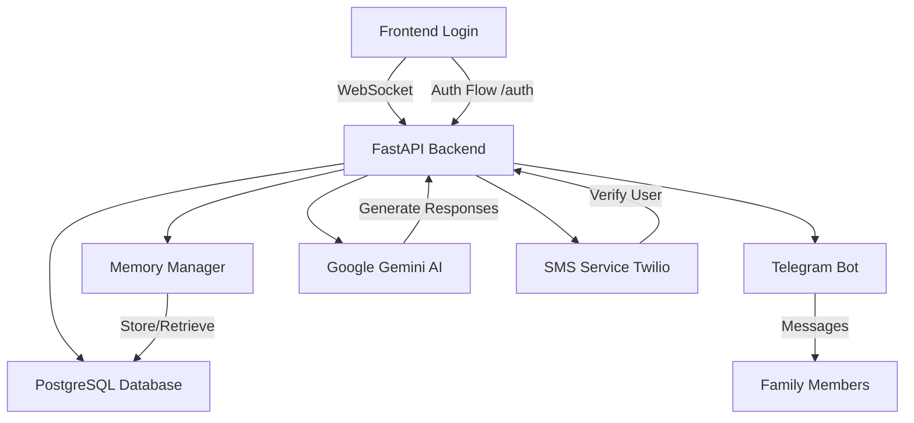
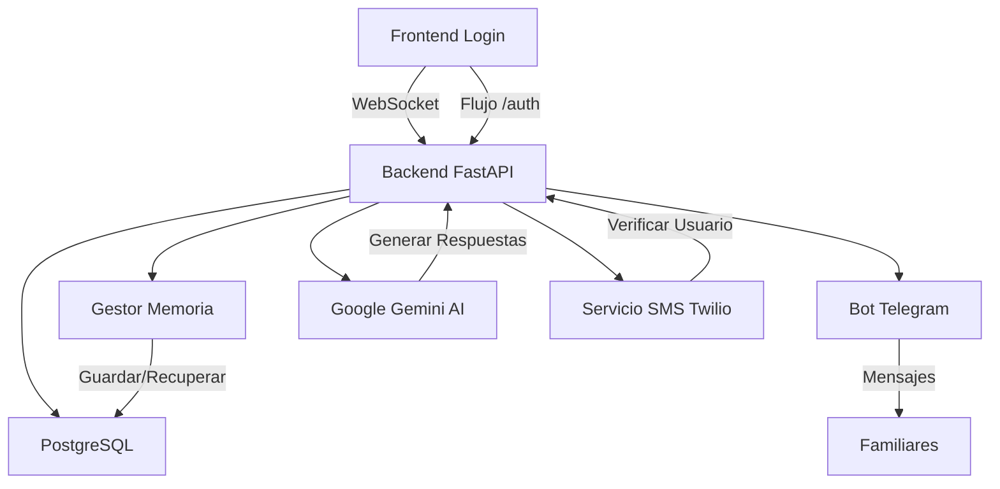

# 🧠 Compa - AI Voice Assistant for Alzheimer's Care

(it's done for Spanish Speakers, but also works in other languages, [Versión en Español](#versión-en-español)

## 🇬🇧 English Version

Compa is an innovative AI-powered voice assistant specifically designed to support individuals with memory issues (like the Alzheimer's disease) and their families. It combines real-time voice interaction, memory management, and family communication features to provide a comprehensive care solution.

---
## 🐿️ Index
- [🌟 Key Features](#🌟-key-features)
- [🏗️ Technical Architecture](#🏗️-technical-architecture)
- [💻 Tech Stack](#💻-tech-stack)
- [📂 Repository Structure](#📂-repository-structure)
- [🚀 Getting Started](#🚀-getting-started)
- [🔐 Security Features](#🔐-security-features)
- [📚 API Documentation](#📚-api-documentation)
- [🤝 Contributing](#🤝-contributing)
- [📄 License](#📄-license)
- [🙏 Acknowledgments](#🙏-acknowledgments)
  
---

## 🌟 Key Features

- **🎙️ Voice-First Interaction**: Natural conversation interface using Web Speech API  
- **🧠 Memory Management**: Intelligent system to store and recall personal memories  
- **👨‍👩‍👧‍👦 Family Connection**: Integrated Telegram bot for family messaging  
- **🤖 AI-Powered Responses**: Context-aware responses using Google Gemini AI  
- **🔄 Real-Time Updates**: WebSocket-based instant communication  
- **🗄️ Database Integration**: Robust PostgreSQL storage with SQLAlchemy ORM  
  _Now includes tables for `user_sessions` and `phone_verifications`._  
- **📱 Device Management**: Multi-device support with secure connection codes  
  _Devices are now linked to verified phone accounts._  
- **🔐 Secure SMS Authentication**: User verification and session creation using **Twilio Verify** to protect access  

---

## 🏗️ Technical Architecture


---

## 💻 Tech Stack

### Backend
- **FastAPI** – High-performance async web framework  
- **SQLAlchemy** – SQL toolkit and ORM  
- **PostgreSQL** – Primary database (via asyncpg)  
- **Google Gemini AI** – Advanced language model integration  
- **python-telegram-bot** – Telegram integration  
- **Twilio** – SMS-based user verification  
- **WebSocket** – Real-time communication  

### Frontend
- **HTML5 / login.html** – Modern login and authentication page  
- **CSS3** – Responsive design with animations  
- **JavaScript** – Web Speech API integration  
- **Authentication Flow Logic** – Handles cookies and session management  
- **WebSocket** – Live updates and communication  

---

## 📂 Repository Structure

```
Compa/
│
├── backend/
│   ├── main.py               # FastAPI backend and WebSocket
│   ├── telegram_bot.py       # Telegram bot integration
│   ├── sms_service.py        # SMS verification logic (Twilio)
│
├── frontend/
│   ├── static/
│   │   ├── index.html        # Main UI
│   │   ├── style.css         # Styling
│   │   └── app.js            # WebSocket, UI, voice logic
│   ├── login.html            # Phone authentication page
│
├── railway.toml              # Deployment script (Release Command) for Railway
├── .env.example              # Template for new Twilio environment variables
├── requirements.txt          # Python dependencies
├── .env                      # Environment configuration (not committed)
├── README.md                 # Documentation
└── LICENSE.md                # License
```

---

## 🚀 Getting Started

### Prerequisites
- **Python >= 3.11**  
- **Telegram account** to set up the bot  
- **API access to Google Gemini** (via developer token)  
- **Twilio account** (Account SID, Auth Token, and Verify SID)  

### Installation Steps

1. **Clone the repository:**
    ```bash
    git clone https://github.com/ogarmar/Compa.git
    cd Compa
    ```

2. **Install Python dependencies:**
    ```bash
    pip install -r requirements.txt
    ```

3. **Configure environment variables (`.env`):**
    ```bash
    GEMINI_TOKEN=your_gemini_api_key
    TELEGRAM_BOT_TOKEN=your_telegram_bot_token
    TWILIO_ACCOUNT_SID=your_twilio_sid
    TWILIO_AUTH_TOKEN=your_twilio_token
    TWILIO_VERIFY_SERVICE_SID=your_twilio_verify_sid
    ```

4. **Start the backend server:**
    ```bash
    python backend/main.py
    ```

5. **Open the frontend in your browser:**
    - Go to `http://localhost:8000/login` to authenticate first.  

---

## 🔐 Security Features

- **Secure SMS Verification**: Access to the app is now protected by phone-based verification (Twilio Verify).  
- **User Sessions**: Each verified user creates a session stored in the database and saved as a `session_token` cookie.  
- **Device Validation**: Each `device_id` is linked to the authenticated user session.  
- **Secure WebSocket Connections**: Encrypted communication in real time.  
- **Database Authentication**: Protected PostgreSQL connections.  
- **Environment Variables**: Secure credential management.  

---

## 📚 API Documentation

### 🧾 Authentication HTTP Endpoints

- `GET /login`  
- `GET /` _(now protected)_  
- `POST /auth/send-code`  
- `POST /auth/verify-code`  
- `POST /auth/validate-session`  
- `POST /auth/logout`  

### 🧩 App HTTP Endpoints _(Protected)_
- `/` – Main application  
- `/static/*` – Static files (CSS, JavaScript)  

### 🧠 WebSocket Endpoints
- `/ws` – Real-time communication, device connection management, and message routing

## 🤝 Contributing

Contributions are welcome! Please feel free to submit a Pull Request. For major changes, please open an issue first to discuss what you would like to change.

## 📄 License

This project is licensed under a custom license - see the [LICENSE.md](LICENSE.md) file for details.

## 🙏 Acknowledgments

- Google Gemini AI for providing the language model
- Telegram for the bot API
- FastAPI community for the excellent framework
- All contributors and supporters of the project

## 📧 Contact

## For support or queries, please open an issue or contact me through our [e-mail](mailto:oscargarciatrabajos@gmail.com)

Made with ❤️ for people with memory issues and their families

Enjoy talking, sharing and building with Compa!

---


------------------------------------------------------------------
------------------------------------------------------------------
------------------------------------------------------------------


# 🧠 Compa - Asistente de Voz con IA para el Cuidado del Alzheimer

[English version above](#english-version)

## 🇪🇸 Version en Español

Compa es un innovador asistente de voz potenciado por IA, específicamente diseñado para apoyar a personas con problemas de memoria (como la enfermedad de Alzheimer) y sus familias. Combina interacción por voz en tiempo real, gestión de memoria y características de comunicación familiar para proporcionar una solución integral de cuidado.

---
## 🐿️ Indice
- [🌟 Características Principales](#🌟-características-principales)
- [🏗️ Arquitectura Técnica](#🏗️-arquitectura-técnica)
- [💻 Stack Tecnológico](#💻-stack-tecnológico)
- [📂 Estructura del Repositorio](#📂-estructura-del-repositorio)
- [🚀 Primeros Pasos](#🚀-primeros-pasos)
- [🔐 Características de Seguridad](#🔐-características-de-seguridad)
- [📚 Documentación de la API](#📚-documentación-de-la-api)
- [🤝 Contribuir](#🤝-contribuir)
- [📄 Licencia](#📄-licencia)
- [🙏 Agradecimientos](#🙏-agradecimientos)

---
## 🌟 Características Principales

- **🎙️ Interacción por Voz**: Interfaz de conversación natural usando Web Speech API  
- **🧠 Gestión de Memoria**: Sistema inteligente para almacenar y recordar memorias personales  
- **👨‍👩‍👧‍👦 Conexión Familiar**: Bot de Telegram integrado para mensajería familiar  
- **🤖 Respuestas con IA**: Respuestas contextuales usando Google Gemini AI  
- **🔄 Actualizaciones en Tiempo Real**: Comunicación instantánea basada en WebSocket  
- **🗄️ Integración con Base de Datos**: Almacenamiento robusto en PostgreSQL con SQLAlchemy ORM  
  _Ahora incluye tablas para `user_sessions` y `phone_verifications`._  
- **📱 Gestión de Dispositivos**: Soporte multi-dispositivo con códigos seguros de conexión  
  _Los dispositivos ahora se enlazan a las cuentas de teléfono verificadas._  
- **🔐 Autenticación Segura por SMS**: Verificación de usuario y creación de sesión usando **Twilio Verify** para proteger el acceso

---

## 🏗️ Arquitectura Técnica

---

## 💻 Stack Tecnológico

### Backend
- **FastAPI** – Framework web asíncrono de alto rendimiento  
- **SQLAlchemy** – Kit de herramientas SQL y ORM  
- **PostgreSQL** – Base de datos principal (vía asyncpg)  
- **Google Gemini AI** – Integración avanzada de modelo de lenguaje  
- **python-telegram-bot** – Integración con Telegram  
- **Twilio** – Verificación de usuario mediante SMS  
- **WebSocket** – Comunicación en tiempo real  

### Frontend
- **HTML5 / login.html** – Página moderna de inicio de sesión y autenticación  
- **CSS3** – Diseño responsivo con animaciones  
- **JavaScript** – Integración con Web Speech API  
- **Lógica de Flujo de Autenticación** – Manejo de cookies y gestión de sesión  
- **WebSocket** – Actualizaciones en vivo y comunicación  

---
## 📂 Estructura del Repositorio
```
Compa/
│
├── backend/
│   ├── main.py               # Backend principal (FastAPI + WebSocket)
│   ├── sms_service.py        # Lógica de verificación SMS (Twilio)
│   ├── telegram_bot.py       # Integración con Telegram
│   ├── database/
│   │   ├── models.py         # Modelos SQLAlchemy (incluye user_sessions y phone_verifications)
│   │   └── __init__.py
│   └── utils/
│       └── auth.py           # Utilidades de autenticación y manejo de sesiones
│
├── frontend/
│   ├── static/
│   │   ├── index.html        # Interfaz principal
│   │   ├── style.css         # Hoja de estilos
│   │   └── app.js            # Lógica de voz, UI y WebSocket
│   ├── login.html            # Página de autenticación por teléfono
│
├── requirements.txt          # Dependencias de Python
├── .env.example              # Plantilla con variables de entorno (Twilio, Gemini, Telegram)
├── railway.toml              # Script de despliegue (Release Command para Railway)
├── README.md                 # Documentación del proyecto
└── LICENSE.md                # Licencia
```
---

## 🚀 Primeros Pasos

### Prerrequisitos
- **Python >= 3.11**  
- **Cuenta de Telegram** para configurar el bot  
- **Acceso a la API de Google Gemini** (vía token de desarrollador)  
- **Cuenta de Twilio** (Account SID, Auth Token y Verify SID)  

### Pasos de Instalación

1. **Clonar el repositorio:**
    ```bash
    git clone https://github.com/ogarmar/Compa.git
    cd Compa
    ```

2. **Instalar dependencias de Python:**
    ```bash
    pip install -r requirements.txt
    ```

3. **Configurar variables de entorno (`.env`):**
    ```bash
    GEMINI_TOKEN=tu_clave_api_gemini
    TELEGRAM_BOT_TOKEN=tu_token_bot_telegram
    TWILIO_ACCOUNT_SID=tu_twilio_sid
    TWILIO_AUTH_TOKEN=tu_twilio_token
    TWILIO_VERIFY_SERVICE_SID=tu_twilio_verify_sid
    ```

4. **Iniciar el servidor backend:**
    ```bash
    python backend/main.py
    ```

5. **Abrir el frontend en el navegador:**
    - Ir a `http://localhost:8000/login` para autenticarse primero.  

---

## 🔐 Características de Seguridad

- **Verificación Segura por SMS**: El acceso a la app ahora está protegido mediante verificación telefónica con **Twilio Verify**.  
- **Sesiones de Usuario**: Cada usuario verificado crea una sesión almacenada en la base de datos y guardada como cookie `session_token`.  
- **Validación de Dispositivos**: Cada `device_id` se asocia a la sesión de usuario autenticada.  
- **Conexiones WebSocket Seguras**: Comunicación cifrada en tiempo real.  
- **Autenticación de Base de Datos**: Conexiones protegidas a PostgreSQL.  
- **Variables de Entorno**: Gestión segura de credenciales y tokens.  

---

## 📚 Documentación de la API

### 🧾 Endpoints HTTP de Autenticación

- `GET /login`  
- `GET /` _(ahora protegido)_  
- `POST /auth/send-code`  
- `POST /auth/verify-code`  
- `POST /auth/validate-session`  
- `POST /auth/logout`  

### 🧩 Endpoints HTTP de la App _(Protegidos)_
- `/` – Aplicación principal  
- `/static/*` – Archivos estáticos (CSS, JavaScript)  

### 🧠 Endpoints WebSocket
- `/ws` – Comunicación en tiempo real, gestión de conexión de dispositivos y enrutamiento de mensajes  

---

## 🤝 Contribuir

¡Las contribuciones son bienvenidas! No dudes en enviar un Pull Request. Para cambios importantes, por favor abre primero un issue para discutir lo que te gustaría cambiar.

## 📄 Licencia

Este proyecto está licenciado bajo una licencia personalizada - ver el archivo [LICENSE.md](LICENSE.md) para más detalles.

## 🙏 Agradecimientos

- Google Gemini AI por proporcionar el modelo de lenguaje
- Telegram por la API del bot
- Comunidad FastAPI por el excelente framework
- Todos los contribuidores y colaboradores del proyecto

## 📧 Contacto

Para soporte o consultas, por favor abre un issue o contáctame a través de [email](mailto:oscargarciatrabajos@gmail.com).

---

Hecho con ❤️ para personas con problemas de memoria y sus familias

¡Disfruta conversando, compartiendo y construyendo con Compa!
