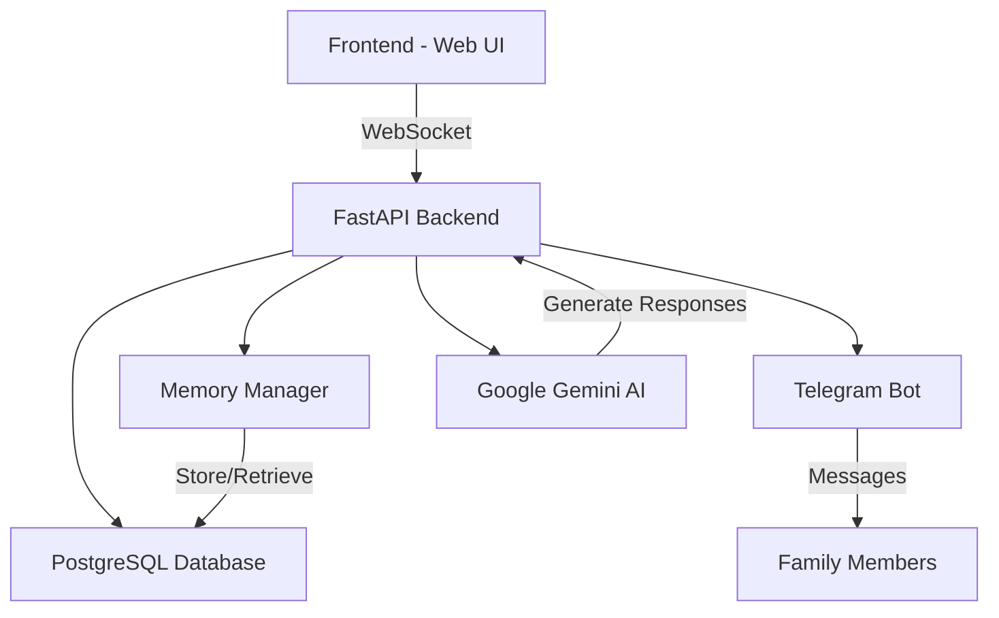

# 🧠 Compa - AI Voice Assistant for Alzheimer's Care

[](https://www.python.org/downloads/)
[](https://fastapi.tiangolo.com/)
[](https://www.sqlalchemy.org/)
[](https://ai.google.dev/)

Compa is an innovative AI-powered voice assistant specifically designed to support individuals with Alzheimer's disease and their families. It combines real-time voice interaction, memory management, and family communication features to provide a comprehensive care solution.

## 🌟 Key Features

- [Features](#features)
- [Architecture Overview](#architecture-overview)
- [Repository Structure](#repository-structure)
- [Getting Started](#getting-started)
- [Configuration](#configuration)
- [Core Components](#core-components)
- [Data Flow](#data-flow)
- [Security Considerations](#security-considerations)
- [Troubleshooting](#troubleshooting)
- [Contributing](#contributing)
- [License](#license)
- [Acknowledgments](#acknowledgments)

---

- **🎙️ Voice-First Interaction**: Natural conversation interface using Web Speech API
- **🧠 Memory Management**: Intelligent system to store and recall personal memories
- **👨‍👩‍👧‍👦 Family Connection**: Integrated Telegram bot for family messaging
- **🤖 AI-Powered Responses**: Context-aware responses using Google Gemini AI
- **🔄 Real-Time Updates**: WebSocket-based instant communication
- **🗄️ Database Integration**: Robust PostgreSQL storage with SQLAlchemy ORM
- **📱 Device Management**: Multi-device support with secure connection codes

## 🏗️ Technical Architecture



## 💻 Tech Stack

### Backend

- **FastAPI**: High-performance async web framework
- **SQLAlchemy**: SQL toolkit and ORM
- **PostgreSQL**: Primary database (via asyncpg)
- **Google Gemini AI**: Advanced language model integration
- **python-telegram-bot**: Telegram integration
- **WebSocket**: Real-time communication

### Frontend

- **HTML5**: Modern semantic markup
- **CSS3**: Responsive design with animations
- **JavaScript**: Web Speech API integration
- **WebSocket**: Live updates and communication

---

## Repository Structure

```
Compa/
│
├── backend/
│   ├── main.py              # FastAPI backend and WebSocket
│   ├── telegram_bot.py      # Telegram bot integration
│
├── frontend/
│   ├── static/
│   │   ├── index.html       # Main UI
│   │   ├── style.css        # Interface stylesheet
│   │   └── app.js           # WebSocket, UI logic, speech features
│
├── requirements.txt         # Backend Python dependencies
├── .env                     # Environment configuration (not committed)
└── README.md                # Documentation
```

---

## Getting Started

### Prerequisites

- Python >= 3.11
- Telegram account to set up the bot
- API access to Google Gemini (via developer token)

### Installation Steps

1. **Clone the repository:**
   ```
   git clone https://github.com/ogarmar/Compa.git
   cd Compa
   ```
2. **Install Python dependencies:**
   ```
   pip install -r requirements.txt
   ```
3. **Configure environment variables (`.env`):**
   ```
   GEMINI_TOKEN=your_gemini_api_key
   TELEGRAM_BOT_TOKEN=your_telegram_bot_token
   ```
4. **Start the backend server:**
   ```
   python backend/main.py
   ```
5. **Open the frontend in your browser:**
   - Go to `http://localhost:8000` (by default)

---

## 📱 Device Management

Compa uses a secure device management system with unique 6-digit codes:

- Each device gets a unique identifier
- Family members connect via Telegram using device codes
- Database-driven device tracking and validation
- Real-time connection status monitoring

## 🔐 Security Features

- **Secure WebSocket Connections**: Real-time encrypted communication
- **Database Authentication**: Protected PostgreSQL connections
- **Device Validation**: Unique code-based device authentication
- **Telegram Authorization**: Whitelist-based user access
- **Environment Variables**: Secure credential management

## 📚 API Documentation

### WebSocket Endpoints

- `/ws`: Main WebSocket connection
  - Handles real-time communication
  - Manages device connections
  - Routes messages and responses

### HTTP Endpoints

- `/`: Serves the main application
- `/static/*`: Static files (CSS, JavaScript)
- Additional API documentation available via SwaggerUI at `/docs`

## 🤝 Contributing

Contributions are welcome! Please feel free to submit a Pull Request. For major changes, please open an issue first to discuss what you would like to change.

## 📄 License

This project is licensed under the MIT License - see the [LICENSE](LICENSE) file for details.

## 🙏 Acknowledgments

- Google Gemini AI for providing the language model
- Telegram for the bot API
- FastAPI community for the excellent framework
- All contributors and supporters of the project

## 📧 Contact

For support or queries, please open an issue or contact us through our [Telegram group](https://t.me/your_support_group).

---

Made with ❤️ for Alzheimer's patients and their families

Compa uses environment variables for sensitive information. Add the following variables to a `.env` file in your project root:

```
GEMINI_TOKEN=your_gemini_api_key
TELEGRAM_BOT_TOKEN=your_telegram_bot_token
```

---

## Core Components

### Backend (FastAPI + WebSocket)

- Handles all application logic and connections.
- Manages WebSocket endpoint `/ws` for real-time communication.
- Loads and persists user memories.
- Processes incoming requests: general chat, family messages, and memory recall.
- Generates responses using the Gemini generative model.

### Telegram Bot Integration

- Retrieves family messages from Telegram chats.
- Handles daily and unread message requests.
- Integrates seamlessly with backend via API calls.

### Memory Management

- Tracks user conversations, events, important dates, preferences.
- Stores, loads, queries, and updates memory objects for rich context.
- Enables personalized, consistent, and context-aware responses.

### Generative AI Model (Gemini)

- Empathetic response generation.
- Integrates memory and conversational context.
- Customizable via prompt engineering.

### Frontend (HTML/CSS/JavaScript)

- WebSocket client for real-time messaging.
- Voice input with Web Speech API.
- Family messages and memory recall UI features.

---

## Data Flow

1. **User interacts via frontend (text/voice):**
   - Input sent to backend over WebSocket.
2. **Backend processes input:**
   - Loads user memory, checks message type.
   - Queries Gemini for generative response or Telegram bot for family messages.
   - Updates memory as needed.
3. **Backend responds:**
   - Sends reply back over WebSocket.
   - Response is displayed and (optionally) spoken using frontend speech synthesis.
4. **Session and memory continuity:**
   - Past interactions influence ongoing conversation.

---

## Security Considerations

- **Environment variable protection:** Do not commit `.env` files.
- **API key safety:** Store keys securely and rotate regularly.
- **WebSocket validation:** (Recommended) Authenticate connections for production.

---

## Troubleshooting

- **WebSocket connection issues?:** Confirm backend is running; check CORS settings.
- **Gemini API errors?:** Verify your token, quota, and API service status.
- **Telegram bot not responding?:** Double-check token, bot status, and internet connectivity.

---

## Contributing

Contributions are welcome! Feel free to contact oscargarciatrabajos@gmail.com to discuss your ideas, improvements, or issues. Pull requests and issues are also accepted via GitHub.

---

## License

MIT License

---

## Acknowledgments

- [FastAPI](https://fastapi.tiangolo.com/)
- [Python-Telegram-Bot](https://python-telegram-bot.org/)
- [Google Gemini](https://ai.google.dev/)
- All open-source contributors and projects that make Compa possible.

---

Enjoy talking, sharing and building with Compa!
